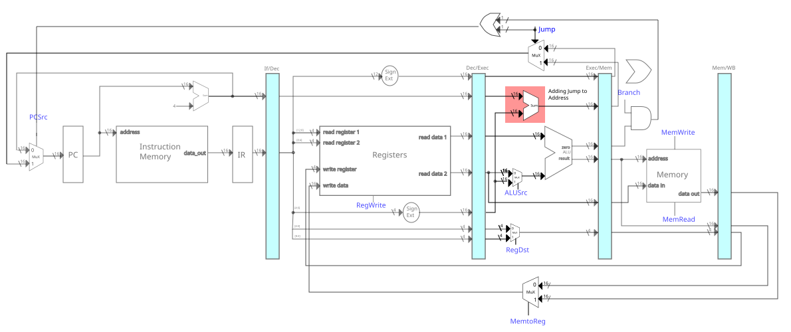

# CPU16 Emulator

       16 bits
|++++|++++|++++|++++|

## Instruction Formats
               4    4   4    4
* R-Type => |++++|++++|++++|++++|
              Op  Src1 Src2 Dst 

               4    4   4    4
* I-Type => |++++|++++|++++|++++|
              Op  Reg1 Reg2 Imm.

               4        12
* J-Type => |++++|++++++++++++|
              Op   Jump Addr.

## Special registers
* zero      -> Contains the zero value in register: 0.

### R-Type

1000 -> Signal of R-Type

* Add => |0100|++++|++++|++++|
* Sub => |0101|++++|++++|++++|
* Mul => |0110|++++|++++|++++|
* Div => |0111|++++|++++|++++|

### I-Type

0100 -> Signal of I-Type

                           base dst     offset
* Load            => |1000|++++|++++|++++|
                           base reg offset
* Store           => |1001|++++|++++|++++|
                           src  dst  imm
* Addi            => |1010|++++|++++|++++|
* Subi            => |1011|++++|++++|++++|
                           reg1 reg2 offset/branching
* Branch-On-Equal => |1100|++++|++++|++++|

### J-Type

0010 -> Signal of J-Type

* jmp =>  |0010|++++++++++++|
* X   =>  |0011|++++++++++++|

# Control Unit

op code => |++++|

The following are the signals to take into account:
* ALUSrc
* RegDst
* RegWrite
* Branch
* MemWrite
* MemRead
* Jump
* MemToReg
* PCSrc

* |01++| => ALUSrc=0,RegDst=0,RegWrite=1,Branch=0,MemWrite=0,MemRead=0,Jump=0,MemToReg=0, PCSrc=0

* |10++| => ALUSrc=1,RegDst=1,RegWrite=1,Branch=0,Jump=0,PCSrc=0
    - |1000| +=> MemRead=1,MemWrite=0,MemToReg=1    (LOAD)
    - |1001| +=> MemRead=0, MemWrite=1,MemToReg=0   (STORE)
    - |101+| +=> MemRead=0, MemWrite=0,MemToReg=0
* |11++| => ALUSrc=0,RegDst=0,RegWrite=0,Branch=1,MemWrite=0,MemRead=0,Jump=0,MemToReg=0, PCSrc=0
* |001+| => ALUSrc = 1,RegDst=0,RegWrite=1,Branch=0,MemWrite=0,MemRead=0,Jump=1,MemToReg=0,PCSrc=1

## ALU Control

This control unit determines the specific operator that the ALU will execute.

# Architecture

The central component is the **Emulator** that connects all the components required to emulate a Von Neumann Architecture CPU.

## Emulator

The Emulator is an *abstract class*. For every new CPU and the specified Instruction Set, a new class (e.g., Emulator16) will have to be defined.
This has been done with the **Emulator16** class

### Emulator16
The **Emulator16** provides a set of possible operations that the cpu can execute.
These operators are stored in a **OperatorTable**.

## OperatorTable
An **OperatorTable** is a *map* to all the possible operations that the cpu can execute.
The map stores **Operator**s which are *abstract classes*.

The motive for the OperatorTable and the Operator objects is to avoid
the use of *if/else* to decide which operator to apply on the cpu and its registers.

### Operator
The **Operator** is an abstract class.
The derived class would provide the actual operation.
For example: OpAdd would implement the function *func* to apply the add operation.

## CPU

The CPU contains the:
* Program Counter
* Registers
* Current Instruction

Before executing, the CPU must fetch the next instruction from the **InstructionMemory**.

## InstructionMemory

The **InstructionMemory** stores all the available instructions for the CPU to execute.

## Compiler

The compiler is responsible for translating the assembly source code into the machine code.
It does so by implementing three components:
* Tokenizer
* parser
* MachineCodeGenerator

### Tokenizer

The Tokenizer has the following type:

$$Tokenizer: filePath \to [TokenLine]$$

The *TokenLine* is a set of **Tokens** the represent a line in source assembly code.

### Parser

The Parser has the following type:

$$Parser: [TokenLine] \to [ParserNode]$$

that ensures the *grammar* of the code is followed.
As the assembly code has an instruction per line, a *parser node* represents the specific instruction in a line.

### Machine Code Generator

The Machine Code Generator has the following type:

$$MachineCodeGenerator: [ParserNode] \to [MachineCode]$$

that maps the ParserNode to the corresponding *machine code*.
For this specific instance, the *MachineCode* is in a *uint16_t* format.

With these three components, we can chain them together as follows:

$$MachineCodeGenerator(Parser(Tokenizer(\text{"file-path"})))$$

With a list of machine code instructions, we can add these instructions to the **InstructionMemory**.
This is demonstrated in the **Emulator** implementation.

The benefit of this functional approach is that we are able to isolate each component in order to test their functionality; isolating the bugs to their respective components.

# Pipeline Architecture

The pipeline architecture is based on the 32-bit MIPS architecture.

1. Fetch
2. Decode
3. Execute
4. Memory
5. Write Back

This emulation does not implement solutions to *pipeline hazards*.

## Fetch Stage

In the *fetch* stage, there is one decision to make:
* Either to use the next instruction address or the *branch/jump* instruction address.

## Exec Stage

#### Selecting ALU Value

#### Register Destination Address

#### Jump Address Addition

## Memory Write

#### Jump Address Addition

## Write Stage

#### Write Data

## Pipeline Registers

We have the following registers.
* If/Dec register
* Dec/Exec register
* Exec/Mem register
* Mem/WB register

Each register has the following setting:
* valid

If the pipeline register is valid, then the pipeline executes.
If not, then the pipeline does not execution.

### If/Dec Register 

Register contains the following data:
* instruction
* PC + 4

### Dec/Exec Register

This register contains the following data:
* PC + 4
* read reg one
* read reg two
* control op
* immediate value
* Write address/instruction

### Exec/Mem Register

This register contains the following data:
* Branched PC
* zero
* ALU result
* read reg two
* Write address/instruction

### Mem/WB Register

This register contains the following data:
* Read data
* ALU result
* Write address/instruction
